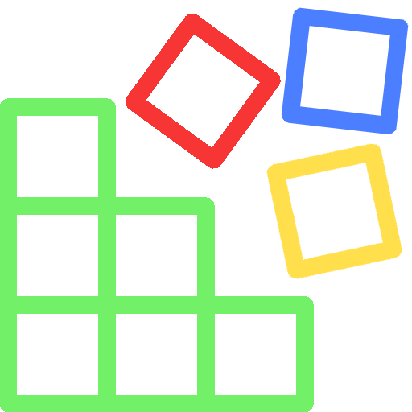

 

<h1>SellerScreen-2022</h1>

    
 

 
 

### What is SellerScreen-2022?

SellerScreen is a high-performance desktop application for Windows. It helps manage employees, warehouses, publicly available devices, sales and expenses.
